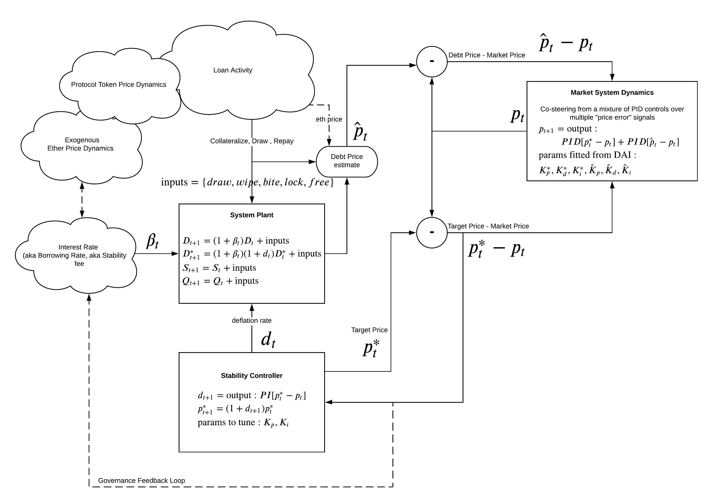
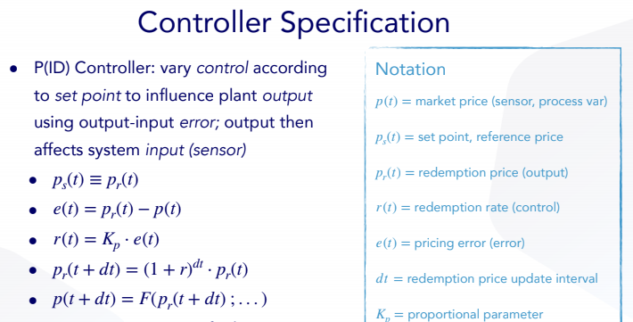
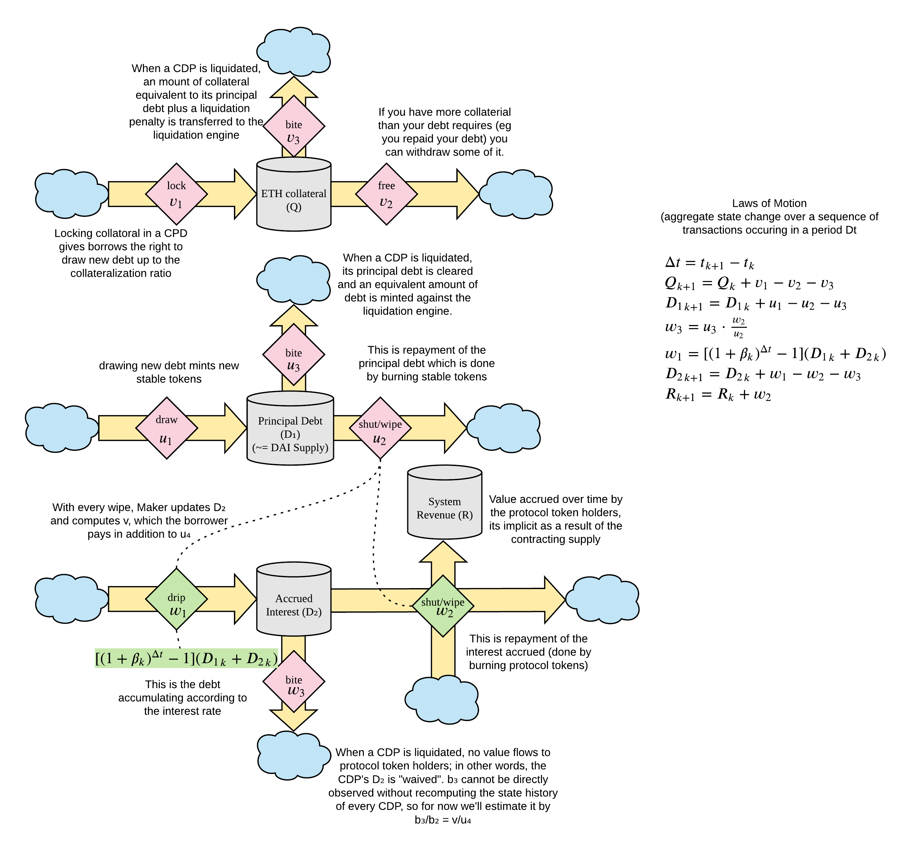

# Reflexer, RAI

<p align="center"></p>

# Project Overview
[Rai is a decentralized protocol that reacts to market forces to modify the value of a collateralized asset.](https://medium.com/reflexer-labs/stability-without-pegs-8c6a1cbc7fbd)  Rai allows anyone to leveralge crypto assets to issue a "reflex bond" that follows the price of its underlying collateral in a less volatile way. The stated goal is to stabilize the secondary market price for RAI debt, using the redemption price as a stabilizer. The benefits of such stabilization is a reduction in the volatility of the market price, thereby increasing predictability, while at the same time creating a flexible response instrument that can counteract or dampen unanticipated market shocks (such as liquidity cascades arising outside of the system).

To achieve this goal, RL implemented a Proportional-Integral-Derivative (PID) controller, based upon a reference document approach for the [Maker DAI market that was never implemented](https://steemit.com/makerdao/@kennyrowe/digital-money-a-simulation-of-the-deflation-rate-adjustment-mechanism-of-the-dai-stablecoin). This controller (described in more detail in what follows) is the most commonly implemented real-world stability controller type in the world, and both its modeling structure and its parameter tuning are well-researched problems.


# Goals
The goals of this repository are to create a cadCAD model to simulate the Reflexer, Rai system with the Arbitrage Pricing Theory (APT) to act as “bridge” between CDP and secondary market. The simulations used here will help design the incorporation of PID controller into a closed-loop system, and select the parameters that optimize how the system responds to price changes in order to achieve overall objectives. In short, 
* Smoothing of secondary market price movements without assuming a redemption price peg
* Stability of the controller for a range of exogenous shocks
* Graceful startup and shutdown of controller in response to system events

## System Mechanisms
### Controller Specification
For a great, "plan English" overview of a PID controller, visit the Rai [whitepaper](https://github.com/reflexer-labs/whitepapers/blob/master/English/rai-english.pdf)
Mathematical representation:


See [Documenting Model Selection Presentation](https://drive.google.com/drive/u/1/folders/1uW7U2dtrlhb91bkvKzs-Vbh2MBoc7ifZ) for more information.

See [Parameter overview](https://drive.google.com/file/d/1Ud1D3Jq05GcoU7h9IYKf5zGAmxIuzX_X/view) here for more details about the parameters and KPIs
    
    
## RAI Arbitrageur Model
[Click here to see model specifications](https://hackmd.io/@jshorish/Hkdj9NhRw)

## AMM Arb Model
[Click here to see model specifications](https://hackmd.io/7Z2e-Is7Toi-5SaRl4K3tA?view)

## Aggregate Arbitrageur model specifications
[Click here to see model specifications](https://hackmd.io/vG1Dg_zGT1azTziLv9H7xg)
    
    

# Where to start?

The current model, **System Model v3.0**, is a full system model with CDP and APT system model, using a stochastic Ethereum price and liquidity demand process as a driver, under different PI controller settings.**System Model v2.0**, integrates a CDP subsystem, a secondary market subsystem, and applies [Arbitrage Pricing Theory (APT)](https://www.investopedia.com/terms/a/apt.asp) to the **System Model v1.0** model. The **System Model v1.0** model consisted of an estimated "debt price" regressor model, and a fitted market model, with a PI controller in the loop.

The latest notebook would be the **System Model v3.0** [full system model notebook](notebooks/system_model_v3/v3_debt_market_model.ipynb). Please see the below in this README about the Scipy patch that needs to be applied, and the Pickle files you'll need to download for the ML model. The model code used within the notebook can be found in `models/system_model_v3/`.


Click [here](parameter_methodology.md) for information about cadCAD parameter sweeping methodology. 

The table of contents and glossary below should serve as a guide.

## Table of Contents

Each model is located under `models/_`, with a unique name for each experiment.

* `models/run.py` - script to run simulation experiments
* `models/_/model` - model configuration (e.g. PSUBs, state variables)
* `models/_/model/parts` - model logic, state update functions, and policy functions

Directories:

* `diagrams/` - system diagrams, used in documentation
* `experiments/` - experiment results, code, and run logs.
* `exports/` - exports from simulations, such as datasets, charts, etc.
* `lib/` - third party libraries modified for use within models and simulations, such as Scipy which had to be patched
* `logs/` - output directory for cadCAD model logs (local only, in `.gitignore`)
* `models/` - system and subsystem models, as well as ML/regression model development
* `notebooks/` - lab notebooks for model simulation and visualization using cadCAD (some notebooks have synced `.py` templates, see "Jupyter Notebook" below)
* `plots/` - static plots used in notebooks
* `simulations/` - execution of simulation notebooks using Papermill
* `tests/` - `pytest` tests and misc. testing resources
* `utils/` - utility code used within notebooks, for example generating plots

Files:

* `shared.py` - file containing shared notebook imports and setup

## Glossary

See [GLOSSARY.md](./GLOSSARY.md) markdown file.

# Models

[Model versions](https://drive.google.com/drive/u/1/folders/1uW7U2dtrlhb91bkvKzs-Vbh2MBoc7ifZ) 


## System Model v3.0: Full CDP and APT system model

Full system model with CDP and APT system model, using a stochastic Ethereum price and liquidity demand process as a driver, under different PI controller settings.

* Model code: `models/system_model_v3/`
* Debt Market Model Notebook: `notebooks/system_model_v3/v3_debt_market_model.ipynb`

### Stochastic Generator Notebooks
1. [Eth Exogenous Process](notebooks/Stochastic_Generators/Eth_Exogenous_Process_Modeling.ipynb)
2. [Uniswap Exogenous Process](notebooks/Stochastic_Generators/Uniswap_process_modeling.ipynb)
### Analysis Notebooks

1. [Full system model - simple run](notebooks/analysis/Single_run.ipynb)
2. [Full system model - MC - WIP](notebooks/analysis/Monte_carlo_run.ipynb)
3. [Shock Test](notebooks/analysis/Shock_Tests.ipynb)
4. [Grid Search Sensitivity-WIP](notebooks/analysis/Grid_Search_Sensitivity.ipynb)
5. [RAI Mainnet subgraph access](notebooks/analysis/TheGraphDataSetCreation.ipynb)
6. [RAI Mainnet subgraph analysis](notebooks/analysis/TheGraphDataAnalysis.ipynb)


Additional experiment log files and notebooks can be found [here](notebooks/analysis/Experiments_run.md)


### Unsupported
## System Model v2.0: CDP, APT, Secondary Market Subsystems

<p align="center"></p>

Full system model with CDP, APT, and secondary market subsystems. See [slides 17-21](https://drive.google.com/drive/u/1/folders/1uW7U2dtrlhb91bkvKzs-Vbh2MBoc7ifZ)

* Model code: `models/system_model_v2/`
* Notebooks: `notebooks/system_model_v2/`

### Notebooks

1. [Full system model](notebooks/system_model_v2/notebook_debt_market.ipynb)


## System Model v1.0: Debt Price Regression and Fitted Market Model

This version of the model is for understanding the debt mechanism. Experimentation of posit exogenous processes for debt price and market price, and test stability controller. See [slides 13-16](https://drive.google.com/drive/u/1/folders/1uW7U2dtrlhb91bkvKzs-Vbh2MBoc7ifZ)

Full system model with parameters for selecting & stress testing subsystems, such as the controller, the debt price regression model, and the fitted market model.

* Model code: `models/system_model_v1/`
* Notebooks: `notebooks/system_model_v1/`

### Notebooks

1. [Market Price Driven Model: PI Controller Tuning](notebooks/system_model_v1/notebook_validation_market_price.ipynb)
    * The purpose of this experiment is to tune and test the PI controller, by driving the market price directly.
1. [Debt Price Driven Model: PI Controller Tuning](notebooks/system_model_v1/notebook_validation_debt_price.ipynb)
    * The purpose of this experiment is to tune and test the PI controller, by driving the debt price directly.
2. [Debt Price Model & Market Model Validation](notebooks/system_model_v1/notebook_validation_regression.ipynb)
    * The purpose of this experiment, is to validate the system model, using a debt market regression model trained using historical data.

## Solidity / cadCAD "Cross Model"

* Model code: `cross-model/`

## Market Model

* Model code: `models/market_model/`

## APT Model

* Model code: `models/apt_model/`

---

# Dependencies

## Large File Dependencies

The following pickle files in `models/pickles/` should be obtained from the [BlockScience/Reflexer shared Google Drive folder](https://drive.google.com/drive/u/1/folders/14pJWIQytibnfZM32YaeemW5FVqj4PpE5), and copied or linked into the repo. They are ignored in the `.gitignore` file to avoid hitting file size and bandwidth limits:

* `apt_debt_model_2020-11-28.pickle`

## System Dependencies

You'll need to install `swig` for the `auto-sklearn` Python library:

### macOS

```bash
brew install swig@3
```

### Ubuntu

```bash
apt-get remove swig
apt-get install swig3.0
rm -rf /usr/bin/swig3.0 /usr/bin/swig
ln -s /usr/bin/swig3.0 /usr/bin/swig
```

# Note: If you are using Anaconda distribution of python, install via:
```bash
conda install gxx_linux-64 gcc_linux-64 swig
```

## Python Dependencies

You'll need Python 3+ and NodeJS/NPM (v10.13.0) in your environment.

```bash
python3 -m venv venv
source venv/bin/activate
pip3 install wheel
pip3 install -r requirements.txt
jupyter labextension install jupyterlab-plotly@4.9.0 # --minimize=False
python -m ipykernel install --user --name python-reflexer --display-name "Python (Reflexer)"
jupyter-lab
```

The Scipy minimize function needs to be patched. Apply the following patch, updating the path to `scipy` in your environment:

```bash
patch venv/lib/python3.8/site-packages/scipy/optimize/optimize.py lib/scipy.patch
```

# Jupyter Notebook

To start Jupyter Lab, with all dependencies available:
```bash
source venv/bin/activate
jupyter-lab
```

# Modelling & Simulation

## cadCAD Model Simulation

See relevant simulation notebooks.

Example model configuration and simulation execution:
```python
from models.run import run
from models.config_wrapper import ConfigWrapper
import models.system_model_v2 as model

simulation = ConfigWrapper(model)
simulation.append()

result = run(drop_midsteps=True)
```

## Resources
* [Tutorial](https://github.com/cadCAD-org/demos/blob/master/tutorials/numerical_computation/numerical_integration_1.ipynb) on how to use cadCAD for numerical integration.

<!---

## Solidity / cadCAD Cross-Model Simulation

```bash
cd ./cross-model/truffle
npm install
npm run setup-network
# Open and run notebooks/solidity_cadcad/notebook_solidity_validation.ipynb
```

# Tests

## Unit Tests

`python -m pytest ./tests`

## System Shock Tests

See `tests/run_shock_tests.py` for the set of Ki and Kp parameter sweeps.

```bash
python tests/run_shock_tests.py
```

Outputs:
* `exports/_.png` - metric grid for each set of parameters
* `notebooks/system_model_v1/shock_tests.ipynb` - template notebook for running test and generating grid
---!>


