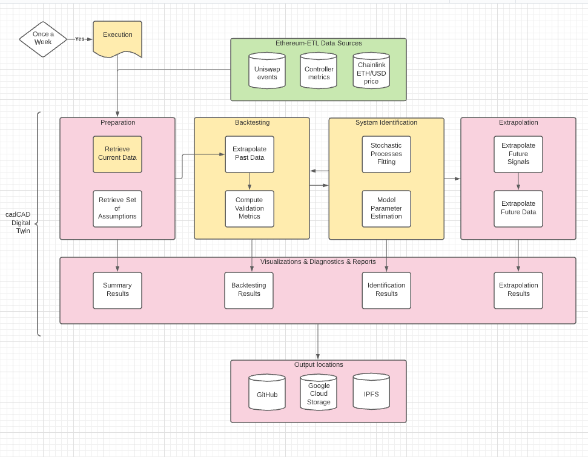

# Reflexer Digital Twin

## Introduction

The Reflexer Digital Twin is a comprehensive modular toolkit for performing automated routine tests and system predictions that are aware of the controller fundamentals as well as the available live data.

The backtesting and extrapolation components are powered by cadCAD, a framework for generalized dynamical systems that allows for expressing the behavioural and logical mechanisms behind crypto-economic systems.

Specifically, it accomplishes the following functions:

- Data Interface: The DT has integration with the same live data that the RAI controller, as well as integrations with Data Lakes for exporting result sets.
- Backtesting: The DT is able to verify the past controller behaviour to make sure that it is working as intended.
- System Identification: The DT is able to identify and quantify past patterns for usage in extrapolation and scientific contexts.
- Future State Extrapolation: The DT is able to make use of data-driven mechanisms in order to extrapolate and predict the system trajectory over the future.
- Report Generation: The DT is able to generate diagnostics and rich visualizations that informs about the state of the system with a acessible focus.

## Usage 

`python -m rai_digital_twin`

### Execution

### Result Analysis

### Testing

The Reflexer Digital Twin uses `pytest` for unit and integration testing. In order to make use of it, just pass:

``python -m pytest``

## Components

### Reports

TODO

### Data interface

TODO

### Backtesting

TODO
### System Identification

TODO
### Future State Extrapolation

TODO
## References

- Scope document: https://hackmd.io/NXJNI2YVQziB3STBNH2Wjw
- Lucid chart: https://lucid.app/lucidchart/invitations/accept/inv_20c6ce89-4331-4cad-b6f7-4486fc5b3937
- Backtesting scope: https://hackmd.io/G8YvwPAHSq-bDw_rtrJTrQ
- Data sources: https://hackmd.io/r-Wwag4rT5K3U6OuKricXg