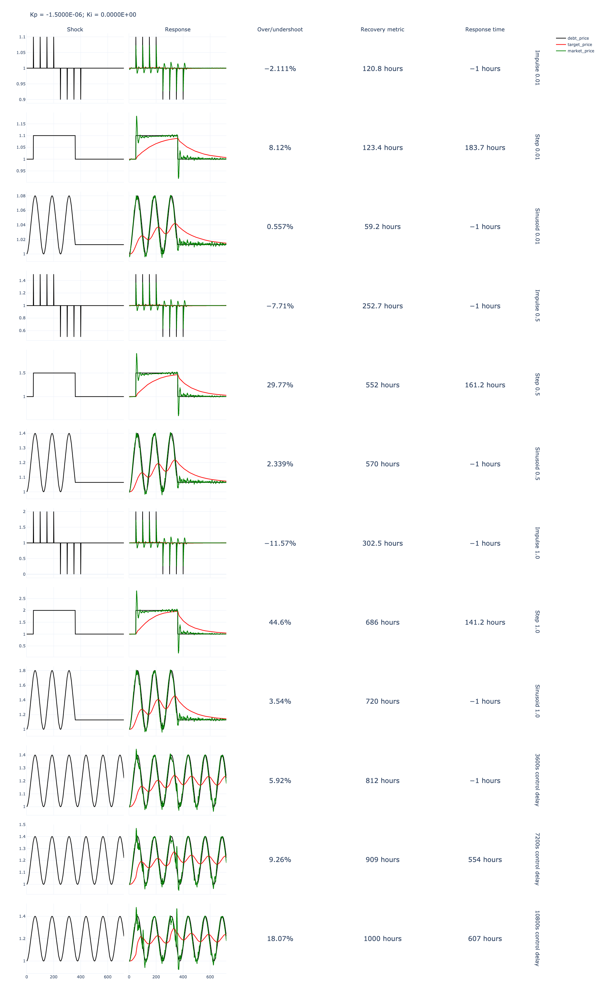

# Parameter Choice Recommendations

* Ideal Kp parameter value for launch: `-1.5e-6`
* Range of Kp parameters given KPI metrics (response time, stability, sensitivity, error): `-3e-06, -2e-06, -1e-06, -9e-07, -8e-07, -7e-07`

## Simulation Metadata

* 4 Monte Carlo runs per shock simulation
* 12 shock simulations:
  * Impulse, step, sinusoid with three amplitudes each (9)
  * Sinusoid with three control delays (3)
* = 48 runs per value in sweep x 50 values = 2,400 total runs over sweep

## Relevant Analysis and Resources

See `exports/shock_datasets` for raw Pandas dataframes.

See `exports/shock_analysis/v1`:
* Paramater choice analysis: `shock_analysis.ipynb`
* Shock metrics: for range of Kp parameters that meet KPIs
* Shock standard deviations: for range of Kp parameters that meet KPIs

See `notebook_solidity_validation.ipynb` for Solidity/cadCAD validation and error stats.

## Parameter Choice Analysis

See `shock_analysis.ipynb`

```
Min. time constant: 3.0 days
Ideal time constant: 168 hours / 7.0 days
Max. time constant: 14.0 days


Ideal Kp: -1.5e-06


    Kp: -3e-06
    Mean time constant: 80.44990740740741
    Time constant sensitivity: -0.5035377958186413
    Time constant elasticity: 0.5035377958186413
    Mean overshoot: 0.45803869670585146
    Max overshoot: 0.4297516801104875
    Overshoot sensitivity: -0.0380733742025789
    Overshoot elasticity: 0.0380733742025789
    

    Kp: -2e-06
    Mean time constant: 120.93027777777777
    Time constant sensitivity: -0.25373049898263017
    Time constant elasticity: 0.7611914969478907
    Mean overshoot: 0.47014167740185764
    Max overshoot: 0.8812729450591856
    Overshoot sensitivity: -0.01265591609973861
    Overshoot elasticity: 0.037967748299215835
    

    Kp: -1.5e-06
    Mean time constant: 162.04638888888888
    Time constant sensitivity: N/A
    Time constant elasticity: N/A
    Mean overshoot: 0.47616801991123286
    Max overshoot: 0.8926639909706813
    Overshoot sensitivity: N/A
    Overshoot elasticity: N/A
    

    Kp: -1e-06
    Mean time constant: 243.1517592592593
    Time constant sensitivity: 0.5005071135894446
    Time constant elasticity: -1.5015213407683334
    Mean overshoot: 0.4821790459072706
    Max overshoot: 0.9039971349994271
    Overshoot sensitivity: 0.012623749904830504
    Overshoot elasticity: -0.03787124971449151
    

    Kp: -9e-07
    Mean time constant: 270.34907407407405
    Time constant sensitivity: 0.6683437127342935
    Time constant elasticity: -1.6708592818357337
    Mean overshoot: 0.4833787736067488
    Max overshoot: 0.9062549380867004
    Overshoot sensitivity: 0.01514329689100113
    Overshoot elasticity: -0.03785824222750282
    

    Kp: -8e-07
    Mean time constant: 303.8011111111111
    Time constant sensitivity: 0.8747786556318748
    Time constant elasticity: -1.8745256906397316
    Mean overshoot: 0.4845781487770494
    Max overshoot: 0.9085131078869946
    Overshoot sensitivity: 0.017662103530985473
    Overshoot elasticity: -0.03784736470925458
    

    Kp: -7e-07
    Mean time constant: 347.6289814814814
    Time constant sensitivity: 1.1452436173683684
    Time constant elasticity: -2.147331782565691
    Mean overshoot: 0.4857771843063047
    Max overshoot: 0.9107682602833913
    Overshoot sensitivity: 0.02018019689113761
    Overshoot elasticity: -0.03783786917088302
```

## Outputs for Kp `-1.5e-6`

### Shock Metrics



### Shock Standard Deviation


### Market Shock Response


### Regression Model Response


### Solidity cadCAD Validation

Error metrics:

```
Max error: 0.001549358635118292
Std. error: 0.000493563911806611
Mean error: -5.243893138066842e-05
Abs. mean error: 0.00037834760494943686
```


